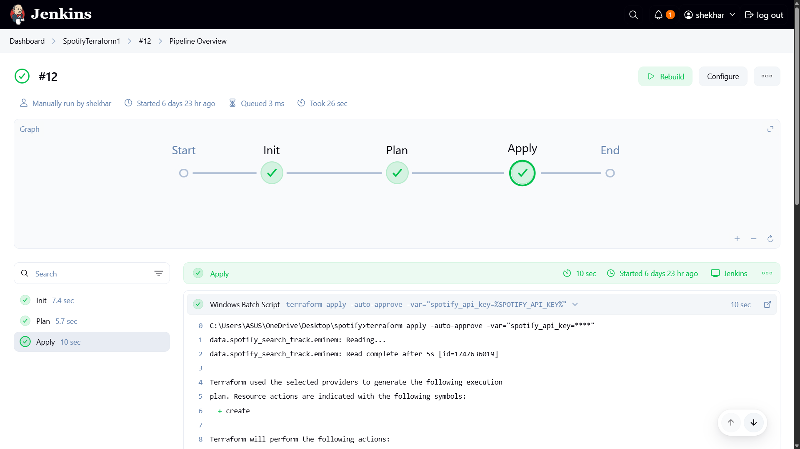

# 🎧 Terraform-Spotify Playlist Automation

This project uses **Terraform**, **Spotify API**, **Docker**, and **Jenkins** to automatically create a Spotify playlist from your favorite artist or track. It integrates a proxy-based authorization system and supports CI/CD automation using Jenkins.

---

## 📌 Features

- 🔍 Search Spotify for tracks using Terraform data sources
- 🎼 Automatically generate a playlist with selected tracks
- ⚙️ Automate `terraform plan` and `apply` using Jenkins
- 🔐 Secure API authentication using Docker-based authorization proxy

---

## 🚀 Tech Stack

- Terraform (`v1.0+`)
- Jenkins (CI/CD)
- Docker
- Spotify Developer API
- GitHub

---

## 📝 Prerequisites

- [Terraform](https://www.terraform.io/downloads.html)
- [Docker Desktop](https://www.docker.com/products/docker-desktop)
- A [Spotify account with Developer Access](https://developer.spotify.com/dashboard)
- Jenkins (optional but recommended for automation)

---

## 🔐 Step 1: Create Spotify Developer App & API Key

1. Go to [Spotify Developer Dashboard](https://developer.spotify.com/dashboard).
2. Click **"Create an App"**.
3. Fill in the form:
    - **Name:** Terraform Playlist Demo  
    - **Description:** Create a Spotify playlist using Terraform
4. Agree to the Terms and click **Create**.
5. Click **Edit Settings** on your new app.
6. Add this redirect URI:
   ```
   http://localhost:27228/spotify_callback
   ```
7. Click **Save**.
8. Copy your **Client ID** and click **Show Client Secret**.

---

## 📁 Step 2: Create `.env` File

```bash
touch .env
```

Paste this inside:

```env
SPOTIFY_CLIENT_ID=your_client_id_here
SPOTIFY_CLIENT_SECRET=your_client_secret_here
```

---

## 🐳 Step 3: Run Spotify Authorization Proxy Server

```bash
export SPOTIFY_CLIENT_REDIRECT_URI=http://localhost:27228/spotify_callback

docker run --rm -it -p 27228:27228 --env-file ./.env ghcr.io/conradludgate/spotify-auth-proxy
```

You will see an **Auth:** URL in the terminal.  
Open it in a browser → log in with Spotify → wait for **"Authorization successful"**.  
Keep the terminal running.

---

## 📥 Step 4: Clone the Terraform Playlist Repo

```bash
git clone https://github.com/YOUR_USERNAME/terraform-spotify-playlist
cd terraform-spotify-playlist
```

---

## 🤖 Step 5: Automate with Jenkins

1. Create a **Jenkins pipeline** project.
2. Store your API key as a **Secret Text Credential** with ID `spotify_api_key`.
3. Use the following `Jenkinsfile`:

```groovy
pipeline {
  agent any
  environment {
    SPOTIFY_API_KEY = credentials('spotify_api_key')
  }
  stages {
    stage('Init') {
      steps {
        sh 'terraform init'
      }
    }
    stage('Plan') {
      steps {
        sh 'terraform plan -var="spotify_api_key=$SPOTIFY_API_KEY"'
      }
    }
    stage('Apply') {
      steps {
        sh 'terraform apply -auto-approve -var="spotify_api_key=$SPOTIFY_API_KEY"'
      }
    }
  }
}
```

---
## ✅ Jenkins CI/CD in Action

This project uses a Jenkins pipeline to automate the Terraform workflow — from `init` to `plan` to `apply`.

### ✅ Jenkins Dashboard


### 🔄 Full Pipeline Execution



## 🌟 Customization Ideas

- 🎨 Change the artist or song in `data "spotify_search_track"`
- 💿 Search by album or song name
- 🔀 Add more tracks dynamically
- 🔎 Explore [`spotify_track` data source](https://registry.terraform.io/providers/conradludgate/spotify/latest/docs/data-sources/track)

---

## 🧠 Future Enhancements

- 🎤 Accept artist input from Jenkins parameters
- 🎚️ Add genre filters
- 🌐 Deploy using GitHub Actions
- 🧠 AI-based track recommendations

---

## 📣 Credits

- Terraform Spotify Provider: [conradludgate/spotify](https://github.com/conradludgate/terraform-provider-spotify)
- Docker Auth Proxy: [ghcr.io/conradludgate/spotify-auth-proxy](https://github.com/conradludgate/spotify-auth-proxy)
- HashiCorp Learn Labs

---

## 📜 License

This project is licensed under the MIT License.
